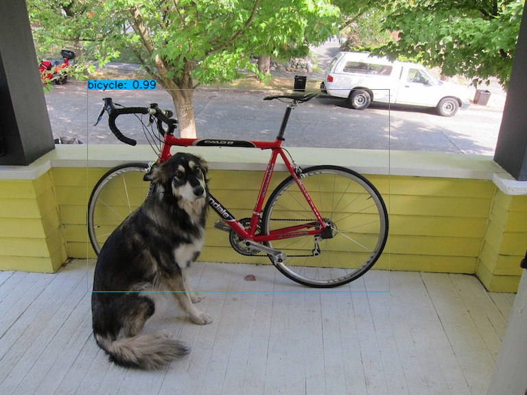
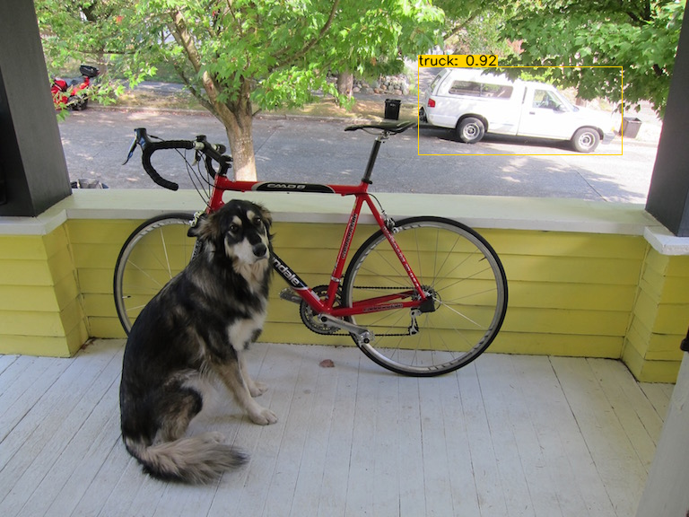
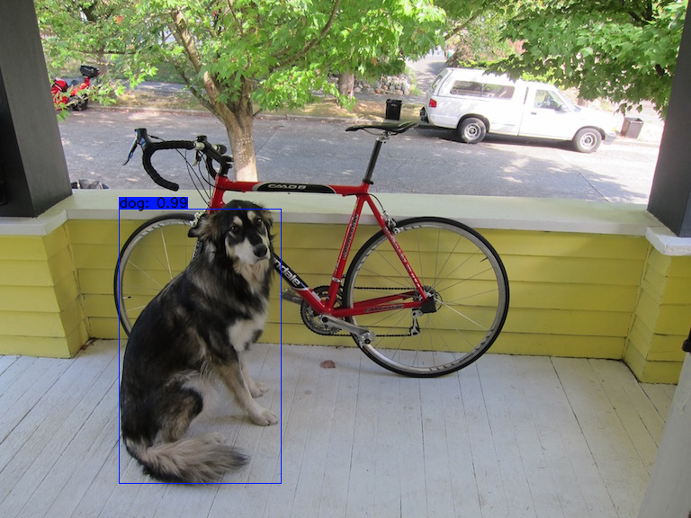

# Custom-Object-Detection-System
Custom class object detection system.

# core - code is from theAIGuysCode
# Download official pre-trained weights from https://drive.google.com/file/d/1cewMfusmPjYWbrnuJRuKhPMwRe_b9PaT/view
# Convert downloaded weights using save_model.py (theAIGuysCode) -> save the converted weights to ./checkpoints/1

# CUSTOM DETECTIONS FROM THE FRAME

# DETECTIONS OF ALL CLASSES FROM THE FRAME

